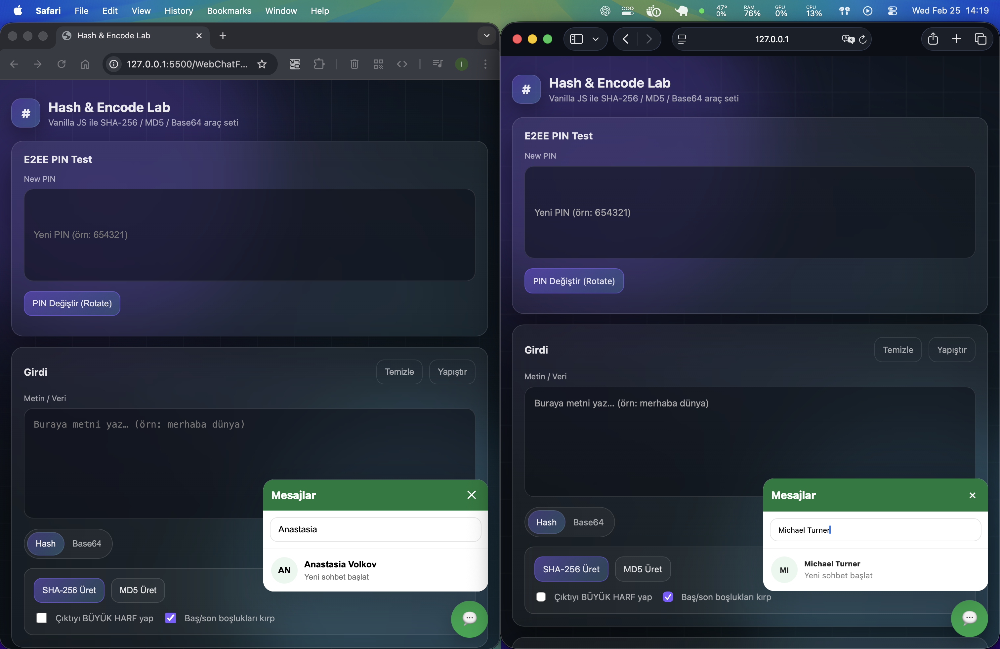
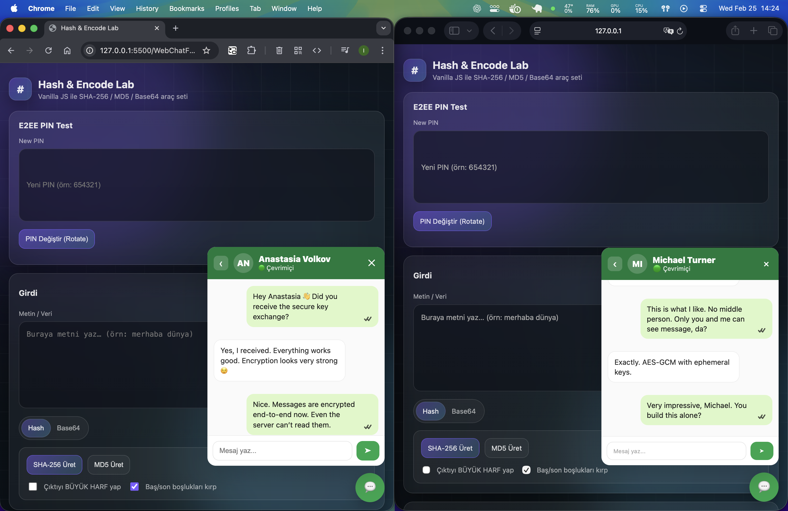
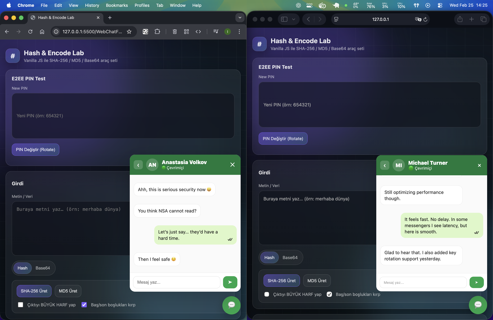

# 🔐 Web Widget Chat – End-to-End Encrypted Real-Time Messaging

## 📸 Preview

<div style="display: flex; gap: 16px; overflow-x: auto;">

  
  
  

</div>

## Description

A secure, real-time web messaging solution that can be embedded into any website as a bottom-right chat widget or message bubble interface.

This project implements End-to-End Encryption (E2EE), ensuring that messages are encrypted on the client and can only be decrypted by the intended recipient. The server never has access to plaintext message content.

🧠 Tech Stack

Backend

	•	Node.js
	•	Express.js
	•	Socket.IO (WebSocket-based real-time layer)
	•	PostgreSQL
	•	JWT Authentication

Cryptography (Client-Side)

	•	Web Crypto API
	•	AES-GCM (authenticated encryption)
	•	PBKDF2 (key derivation)
	•	ECDH (shared secret generation)

🔐 Security Architecture Overview

1️⃣ Authentication Layer

	•	Users authenticate via JWT.
	•	JWT controls access & identity validation.
	•	JWT does NOT handle encryption.

2️⃣ End-to-End Encryption Layer

	•	Messages encrypted using AES-GCM.
	•	Conversation keys derived securely.
	•	ECDH used for shared secret generation.
	•	PBKDF2 used for PIN-based key derivation.
	•	Server stores only encrypted payloads.

#### Important:

The server:

	•	Cannot read plaintext messages
	•	Cannot decrypt private keys
	•	Only stores encrypted blobs

## 🔑 E2EE PIN Flow

Before initializing the widget, the client must call:

```bash
POST /auth/dev-login
```
Body

```bash
{
  "username": "your_username",
  "pin": "your_private_pin"
}
```

What is the PIN used for?

The PIN is used to:

	•	Encrypt the user’s private key before storage
	•	Decrypt the encrypted private key when needed
	•	Activate E2EE messaging flow

Security Guarantees

	•	Private key stored encrypted on server
	•	PIN never permanently stored in plaintext
	•	Database compromise does NOT expose private keys

⚠️ If the client device is compromised, plaintext can be exposed.
This system protects against server/database compromise, not compromised endpoints. Since it's a web-based system, the only way to store the private key is to keep it encrypted on the server.

## 🔁 E2EE PIN Rotation (Change PIN)

Users can securely rotate their E2EE PIN.

When rotating:

	1.	Encrypted identity record is loaded
	2.	Decrypted using old PIN
	3.	Re-encrypted using new PIN
	4.	Stored again securely

Required imports

```javascript
import { onNewPin } from "../chatModule/chat-widget/e2eeKey.js";
import { createState } from "../chatModule/chat-widget/state.js";
import { loadPinFromStorage } from "../chatModule/chat-widget/index.js";

const state = createState();

const oldPin = await loadPinFromStorage(state);
const newPin = "new_secure_pin_here";

if (!oldPin || !newPin) {
  throw new Error("Both old and new PIN are required");
}

if (oldPin !== newPin) {
  await onNewPin(oldPin, newPin);
}
```

After rotation, re-initializing the widget is recommended.

## 🌐 Website Integration

Add this snippet inside your <body>:

```html
<div id="chat-container"></div>

<script type="module">
  import { initChatWidget } from "../chatModule/chat-widget/index.js";

  fetch("../chatModule/chat-widget.html")
    .then(r => r.text())
    .then(html => {
      document.getElementById("chat-container").innerHTML = html;
      initChatWidget();
    });
</script>

<script src="https://cdn.socket.io/4.7.2/socket.io.min.js"></script>
```

Requirements

    •	chat-widget files must be accessible
	•	Socket.IO must be included
	•	initChatWidget() must be called

## 📦 Installation

1️⃣ Clone Repository

```bash
git clone https://github.com/kayailkerugur/WebChat

cd WebChat
```

2️⃣ Install Dependencies

Server:

```bash
cd WebChat

npm install
```

Client:

```bash
cd ../WebChatFrontend

npm install
```

## ⚙️ Environment Configuration

Create .env inside WebChat/:

```bash
PORT=3000
JWT_SECRET=YOUR_JWT_SECRET
CORS_ORIGIN=http://127.0.0.1:5500
MESSAGE_HISTORY_LIMIT=50
RATE_LIMIT_WINDOW_MS=10000
RATE_LIMIT_MAX=20
DATABASE_URL=postgres://localhost:5432/chatdb
```

## 🗄 Database Setup

Create database:

```bash
createdb chatdb
```

Run migration:

```bash
psql -d chatdb -f src/db/migration.sql
```

## 🧪 Local Demo & Testing

Start server:

```bash
cd WebChat

npm install

node src/server.js
```

To test real-time:

	•	Open in two browsers
	•	Or normal + incognito
	•	Select different users

Observe WebSocket & E2EE flow.

## 🛡 Production Recommendations

	•	Use HTTPS
	•	Use wss://
	•	Strong random JWT_SECRET
	•	Enable rate limiting
	•	Use reverse proxy (Nginx recommended)
	•	Implement CSP (Content Security Policy)
	•	Secure token storage strategy

## 🧩 Troubleshooting

* ❌ ECONNREFUSED 127.0.0.1:5432

        PostgreSQL not running.

* ❌ JWT invalid signature

        JWT_SECRET mismatch. Restart server.

* ❌ CORS error

        Ensure CORS_ORIGIN matches frontend URL.

* ❌ WebSocket not connecting

        Check:

            •	Server running
            •	Correct port
            •	ws:// or wss:// configuration

## 🔒 Security Model (Threat Model)

This project protects against:

	•	Server compromise
	•	Database leakage
	•	Backend message inspection

This project does NOT protect against:

	•	Compromised client devices
	•	Malicious browser extensions
	•	Screen capture / keylogging

## 📌 Summary

    •   Real-time encrypted web widget
	•	Secure PIN-based private key encryption
	•	JWT-based authentication
	•	Web Crypto API powered
	•	Database-safe encrypted storage
	•	Production-ready security architecture